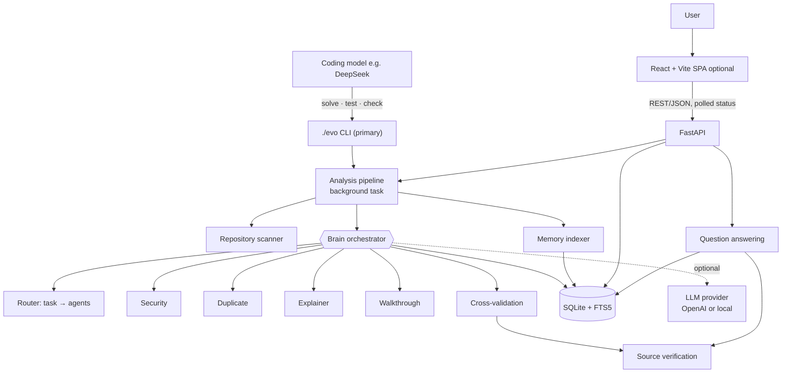
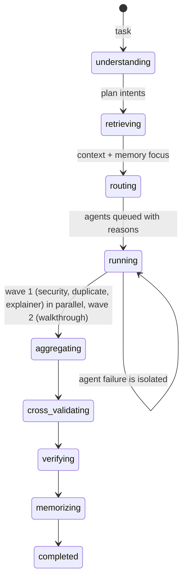
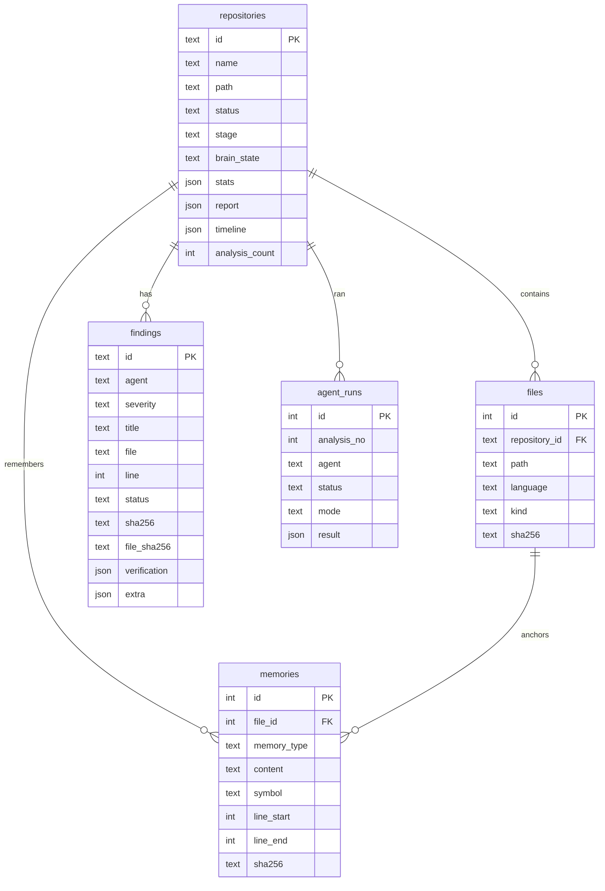
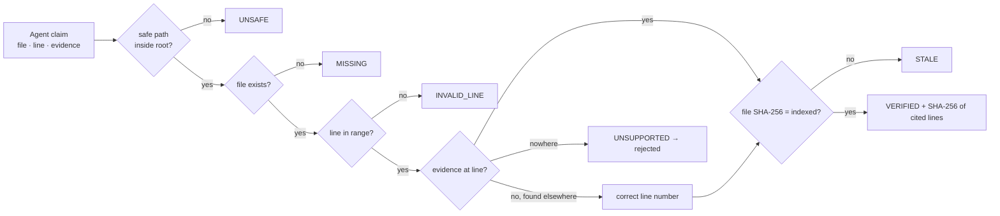
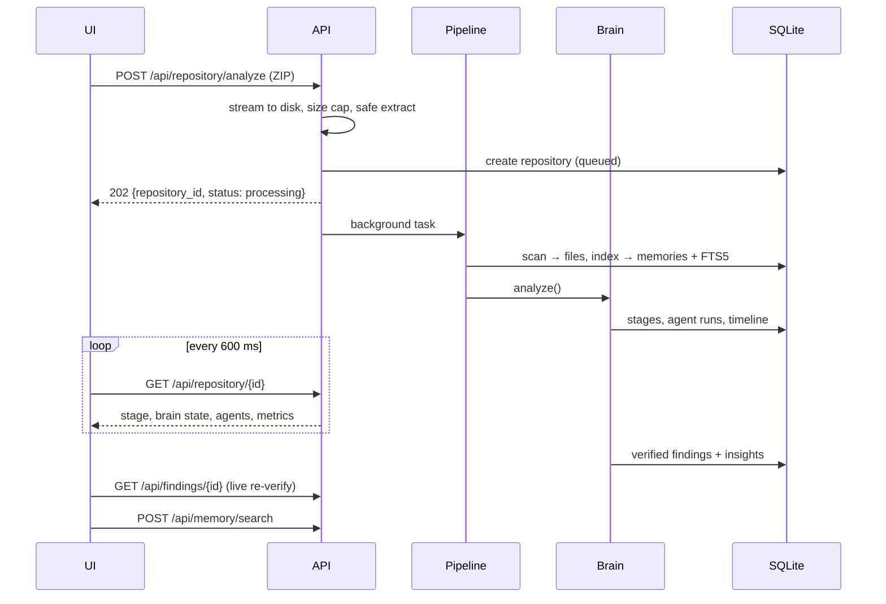

# Architecture

Evo Code is command-line first: `./evo` runs the scanner, SQLite memory store, Brain and agents in a
single local process, with no server, browser or external service. The same engine also backs an
optional two-process setup (a FastAPI backend plus a React SPA) for the dashboard.

Orchestration has three levels: the **Brain** (L0) understands the task and routes it; **lead
agents** (L1) own a domain; **specialist sub-agents** (L2) do the narrow work, in dependency waves.
Two lead agents run on demand rather than during analysis: the **Fixer** (`./evo fix`) turns verified
findings into reviewed patches, and the **Solver** (`./evo solve`) breaks an issue down, locates the
code and runs the repository's tests so a fix can be proven. See [AGENTS.md](AGENTS.md) and
[HARNESS.md](HARNESS.md).

## System architecture

## Frontend architecture

- **Routing**: a tiny hash router (`#/`, `#/repo/:id/:tab`) so refreshes keep state without a router dependency.
- **Data**: `api.ts` (typed fetch wrapper with `ApiError`), `useRepository` polls `/api/repository/{id}` every 600 ms until the analysis settles, then loads findings and the walkthrough. `refreshFindings` triggers live re-verification.
- **Views**: `OverviewTab` (pipeline, Brain, agents, metrics, architecture, cross-validation, log), `FindingsTab`, `MemoryTab`, `WalkthroughTab`; a single `SourceViewer` modal is shared by all tabs.
- **Rendering safety**: repository content is rendered as React text nodes (custom highlighter), never via `innerHTML`.
- The Vite dev server proxies `/api` to `127.0.0.1:8000`, so the browser talks to one origin.

## Backend architecture

| Package | Responsibility |
| --- | --- |
| `api/` | Routes, Pydantic schemas, source viewer endpoints, dependency helpers |
| `evo_cli/` | `main.py` (commands), `console.py`, `orchestration.py` (live stream + agent tree), `views.py`, `solve_views.py`, `session.py` (interactive shell) |
| `orchestrator/` | `brain.py` (orchestration), `router.py` (task → agents), `context_builder.py`, `crossval.py`, `evidence.py` (records + live re-verification), `qa.py`, `pipeline.py`, `progress.py`, `fixing.py` (fix plans + apply), `solving.py` (solve sessions + the gate) |
| `agents/` | `base.py` contract, `team.py` (level-2 delegation runtime), `security.py` + `security_rules.py`, `duplicate.py`, `explainer.py` + `architecture.py`/`flows.py`/`history.py`, `walkthrough.py`, `fixer.py` + `fix_strategies.py`, `solver.py` |
| `memory/` | `database.py` (schema, WAL, corruption recovery), `store.py` (data access), `indexer.py`, `search.py`, `tokens.py` |
| `repo/` | `scanner.py`, `parser.py` (regex/brace-matching parser), `archive.py` (safe ZIP), `github.py`, `paths.py`, `filters.py`, `text.py` |
| `verification/` | `citations.py`: anchor (analysis time) and verify (any time) |
| `llm/` | `provider.py` (OpenAI via httpx, local mock), `prompts.py` (guardrail, redaction, content wrapping) |

`services.py` wires everything once (`build_services`), and `app_factory.create_app()` builds the FastAPI app (tests inject custom settings or providers).

## The Brain

1. **Understand**: `AgentRouter.plan()` maps task keywords to agents and records reasons; dependencies (Walkthrough → Explainer) are added automatically.
2. **Retrieve**: `ContextBuilder` loads indexed files from the working copy, parses them, runs memory searches per domain ("security focus") and recalls insights from the previous analysis.
3. **Route + execute**: agents without dependencies run concurrently; dependent agents get upstream results via `context.with_upstream()`. Each run has a timeout and is wrapped so exceptions become `status="failed"` results.
4. **Aggregate**: drafts (`FindingDraft`) from completed agents are collected.
5. **Cross-validate** (`crossval.py`): anchor every claim, reject unsupported ones, merge duplicates, resolve conflicts, add cross-agent annotations.
6. **Verify** (`evidence.py`): build finding records with SHA-256 anchors; verify Explainer and Walkthrough citations.
7. **Memorize**: replace findings, write finding/insight/history memories, diff with the previous run to record resolved findings.

## Agent architecture

Agents implement `BaseAgent.run(context) -> AgentResult`. They receive a read-only `AgentContext` (files, parsed symbols, memory reader, LLM provider, upstream results) and never touch the database, filesystem or each other. See [AGENTS.md](AGENTS.md).

## Memory engine

- **Passages**: one `symbol` passage per function/class/method, overlapping 40-line `code` windows, one `doc` passage per Markdown section, `config` windows.
- **FTS5**: `memories_fts(content, terms, path, symbol)` with `porter unicode61`; the `terms` column holds split camelCase/snake_case identifiers so "token verification" matches `verifyToken`.
- **Query planning**: stop-word removal, identifier detection, synonym expansion (auth → authentication, login, jwt …), prefix queries; every term is sanitized and quoted before `MATCH`.
- **Ranking**: BM25 (column weights content 1.0, terms 1.2, path 3.0, symbol 5.0) + boosts for exact identifiers, filename and symbol matches; overlapping passages are deduplicated.
- **Fallback**: if FTS5 is unavailable, a `LIKE` scan with term-frequency scoring is used.

## Database

`memories_fts` is an FTS5 table whose `rowid` equals `memories.id`. Connections are short-lived (thread-safe), WAL mode, foreign keys on.

## Source verification

Later, `verify()` recomputes the SHA-256 of the cited lines: unchanged → VERIFIED (even if other parts of the file changed), changed → STALE with a relocation hint when identical lines moved. Hashes use one shared normalization (`repo/text.py`: CRLF→LF, trailing whitespace ignored) so scanner, indexer, verifier and source viewer always agree.

## Request lifecycle

## Repository ingestion

- **ZIP**: streamed to `uploads/` with a byte cap, validated, extracted to `repos/<id>/` (single top-level folder collapsed), then deleted.
- **GitHub**: URL validated against `https://github.com/<owner>/<repo>`; the archive URL is built by Evo Code; redirects are restricted to GitHub hosts over HTTPS.
- **Demo**: `demo-repo/` is copied into an isolated working copy, so the original is never modified.

## Security boundaries

Browser ↔ API (local only, no auth); API ↔ working copies (all file access through `resolve_in_root`); Brain ↔ LLM (redacted, wrapped repository content, JSON-only responses, every claim re-verified). Details in [SECURITY.md](SECURITY.md).

## Failure handling

| Layer | Strategy |
| --- | --- |
| Upload/extraction | Validation errors → HTTP 400/413 before any record is created |
| Pipeline | Exceptions recorded on the repository (`failed` + message); expected errors are user-facing |
| Agents | Timeout + exception isolation per agent; dependents run degraded |
| LLM | `LLMError` caught inside each agent → local fallback + note |
| Database | Corruption detected at startup (`PRAGMA quick_check`) → quarantine + recreate; runtime DB errors → HTTP 503 |
| Restart | In-flight analyses marked failed with a re-run hint |

## Future scaling architecture

For multi-user or large-repository use: move analysis to a job queue (e.g. a worker pool), store memories in PostgreSQL with `pg_trgm`/`tsvector` plus a vector index for semantic retrieval, keep working copies in object storage, run parsing in a sandboxed worker (gVisor/Firecracker), stream progress over SSE/WebSocket instead of polling, and add authentication and per-organization tenancy. The agent contract and verification layer stay unchanged.
