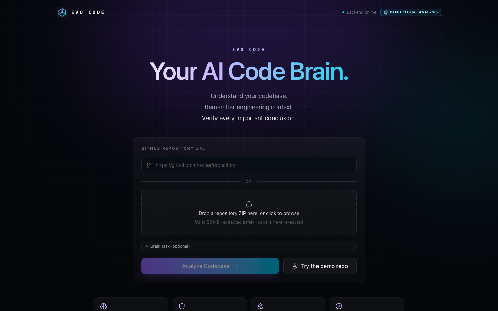
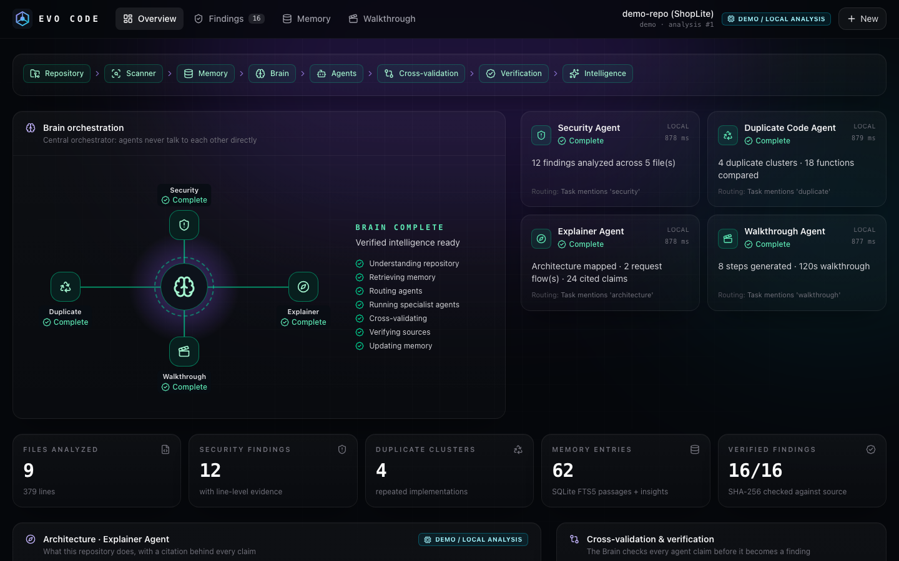
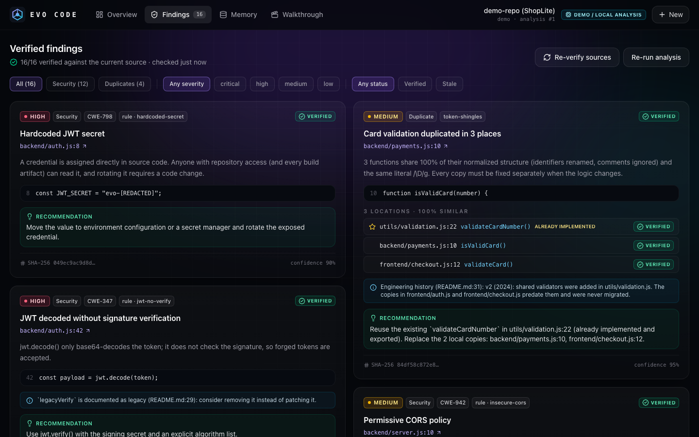
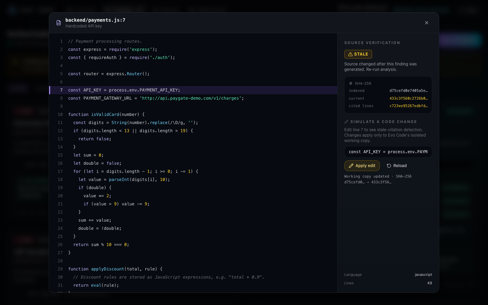
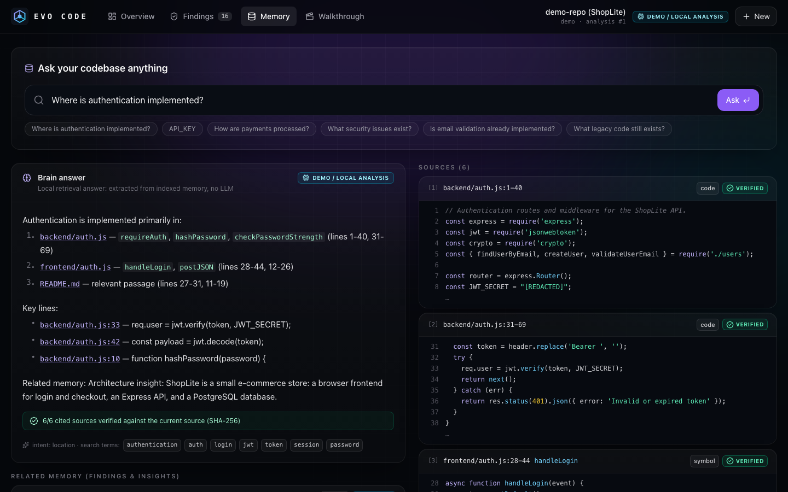
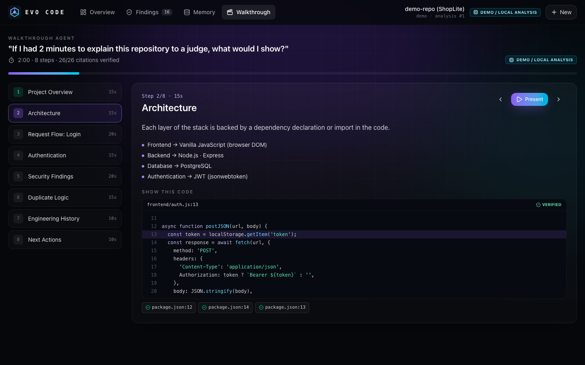
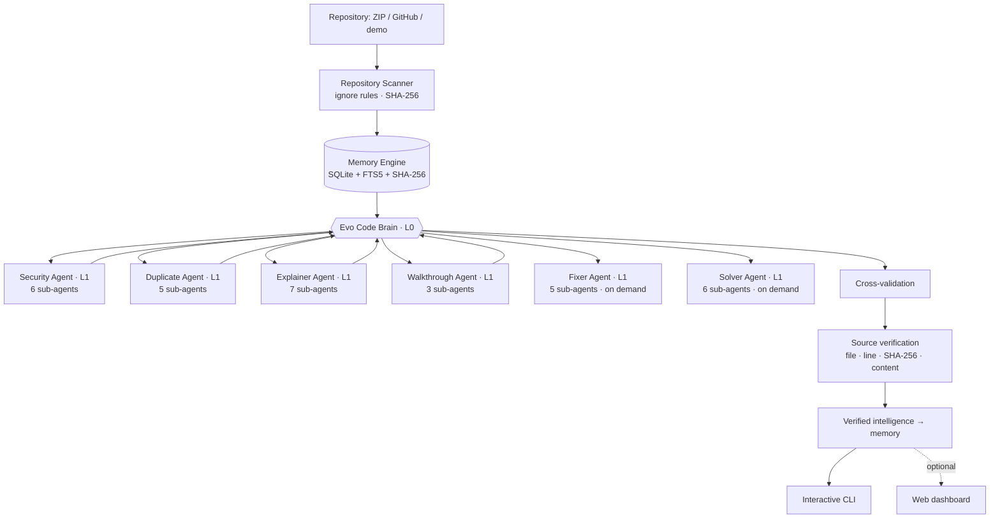

# Evo Code

**Your AI Code Brain.**

Persistent memory. Multi-agent intelligence. Verified source-level reasoning.

> Evo Code is a persistent AI harness that turns a codebase and previous engineering work into verified, reusable memory.

Upload a repository and Evo Code builds a temporary engineering brain around it: it scans and indexes the code into searchable memory, a central **Brain** routes work to specialist agents, cross-validates their claims, and verifies every important conclusion against the actual source with SHA-256. Every finding points at an exact file and line, and Evo Code notices when that source changes.

**Evo Code is command-line first—no server or browser required.**

```bash
./evo demo
# then: tree · findings · show 3 · ask Where is authentication implemented? · walkthrough
```

Three things it does:

```bash
./evo analyze .                      # understand a repository: verified findings, architecture, memory
./evo fix                            # propose reviewed, verified patches for those findings
./evo solve --issue "users.php 500s on empty input"   # break an issue down and prove the fix works
```

Command reference: [CLI.md](CLI.md). Driving Evo Code from a coding model: [HARNESS.md](HARNESS.md).

## Multi-level agent orchestration

Work flows through three levels, and every level is visible in the terminal:

```text
L0  Evo Brain          understands the task, routes work, cross-validates, verifies against SHA-256
L1  6 lead agents      Security · Duplicate · Explainer · Walkthrough · Fixer · Solver
L2  27 sub-agents      the specialists each lead delegates to, in dependency waves
```

```bash
./evo tree      # the whole Brain → lead agents → sub-agents tree of the last analysis
./evo agents    # the same with status, timing and what each specialist found
```

A lead agent's failure never stops the analysis, and a sub-agent's failure never stops its lead: the
rest runs and the result says exactly what was missing. Without an API key the LLM-only specialists
are skipped and labeled, and everything else still runs deterministically and offline.

## Solving issues: Evo Code as a harness for a coding model

Give Evo Code an issue and it does the parts a model is weakest at, then judges the result:

```bash
./evo --json solve --repo . --issue-file issue.md   # breakdown · ranked suspects · failing baseline · plan
#   ...the model (DeepSeek, Claude, anything) writes the patch...
./evo --json apply --session S --patch fix.patch
./evo --json check --session S                      # the gate: exit 0 solved, exit 2 not yet
```

The gate only passes when real source files changed, the whole suite passes, a test that failed
at the start now passes — or, when nothing failed at the start, the change brings a test with it —
and the failing test itself was not rewritten. That last check matters: editing the assertion until
it matches the bug turns the suite green without fixing anything, so the gate refuses it.

The model can send a patch or just edit the files with its own tools; changes are found by comparing
against the SHA-256 recorded for every file when `solve` ran, so neither git nor `apply` is required.
Runners are detected automatically (pytest, unittest, npm, go, cargo), including suites that live in
a subdirectory such as `backend/` or `packages/api/`. Full contract, JSON shapes and exit codes:
[HARNESS.md](HARNESS.md).

## Optional web dashboard

The same engine also ships with an optional React dashboard:

| Home | Brain orchestration |
| --- | --- |
|  |  |
| **Verified findings** | **Source viewer: stale detection** |
|  |  |
| **Memory Q&A with citations** | **Two-minute walkthrough** |
|  |  |

## What it does

- **Repository ingestion**: local folder, ZIP, public GitHub URL, or the bundled demo repo. Extraction is zip-slip and zip-bomb safe; repository code is never executed.
- **Persistent memory**: files, symbols, doc sections and later the Brain's own findings are stored in SQLite with FTS5 full-text search and SHA-256 hashes.
- **The Brain**: understands the task, loads context, retrieves memory, routes agents with explicit reasons, aggregates, cross-validates and verifies.
- **Specialist agents**
  - 🛡 **Security Agent**: 22 evidence-based rules (hardcoded secrets, SQL/command injection, eval, weak JWT handling, CORS, XSS, exposed env vars, prompt-injection text …), optionally reviewed by an LLM.
  - ♻ **Duplicate Code Agent**: structural clone detection that points at the implementation that *already exists* (for example `utils/validation.js`).
  - 🧭 **Explainer Agent**: stack, modules, request flows traced from UI to database, important files and engineering history, each with citations.
  - 🎬 **Walkthrough Agent**: a presentation-ready, two-minute tour built from the other agents' results.
  - 🔧 **Fixer Agent**: turns verified findings into patches that are safety-reviewed and then re-checked against all 22 rules, so a fix is only offered when the finding is gone and nothing new appears. Issues it cannot fix safely (replacing `eval`, switching a password hash) are handed back with the reason.
  - 🧩 **Solver Agent**: breaks a plain-language issue into symptoms and acceptance criteria, ranks the code that needs to change, detects the test runner and captures the failing baseline.
- **Cross-validation**: unsupported claims are rejected, wrong line numbers are corrected, duplicate detections are merged, severity conflicts are resolved.
- **Source verification**: every finding and citation is anchored to the SHA-256 of the cited lines. Change the code and the finding turns **STALE**; re-run the analysis and memory records it as **resolved**.
- **Memory Q&A**: "Where is authentication implemented?" returns an answer with verified `file:line` citations.
- **Honest modes**: with no API key everything runs locally and deterministically, and the CLI/dashboard label it **DEMO / LOCAL ANALYSIS**. Set `DEEPSEEK_API_KEY` (or `OPENAI_API_KEY`) to add the optional LLM specialists.

## How it works



Agents never talk to each other. The Brain passes upstream results explicitly (for example Explainer → Walkthrough) and is the only component that writes findings and memory. Each lead agent delegates to its own sub-agents the same way, one level down. See [ARCHITECTURE.md](ARCHITECTURE.md) and [AGENTS.md](AGENTS.md).

## Quick start — terminal

The CLI requires **Python 3.11+** (tested on 3.14). No Node.js, server, browser, database service, Docker or API key is required.

```bash
git clone https://github.com/rakshak7879-bit/EvoCode-.git
cd EvoCode-
make install                       # or: python3 -m venv backend/.venv &&
                                   #     backend/.venv/bin/pip install -r backend/requirements-dev.txt

./evo demo                         # bundled ShopLite demo + interactive shell
./evo analyze /path/to/repository  # local folder
./evo analyze repository.zip       # ZIP
./evo analyze https://github.com/owner/repo
```

`make` lists every task (`make demo`, `make analyze REPO=…`, `make fix`, `make solve ISSUE=…`,
`make test`, `make doctor` to check your environment).

Inside the shell, try:

```text
evo[abcd1234] › tree
evo[abcd1234] › findings security
evo[abcd1234] › show 3
evo[abcd1234] › ask Where is authentication implemented?
evo[abcd1234] › walkthrough
evo[abcd1234] › help
```

Full command reference: [CLI.md](CLI.md). Optional: `cp .env.example .env` and set `OPENAI_API_KEY` for LLM enrichment; without it the complete deterministic analysis still runs locally.

### Optional web dashboard

Node.js **20.19+ or 22.12+** is only needed for the optional dashboard:

```bash
# terminal 1
cd backend && source .venv/bin/activate && uvicorn main:app --reload

# terminal 2
cd frontend && npm install && npm run dev
# open http://localhost:5173
```

More setup detail: [DEVELOPMENT.md](DEVELOPMENT.md).

## Demo

The bundled [`demo-repo/`](demo-repo) ("ShopLite") is intentionally vulnerable and produces, with no LLM: 12 security findings (6 high), 4 duplicate clusters, 2 traced request flows, a 120-second walkthrough, and 16/16 verified findings. The judge script with timings is in [DEMO.md](DEMO.md).

## Environment variables

All optional. Defaults live in [`.env.example`](.env.example).

| Variable | Default | Purpose |
| --- | --- | --- |
| `DEEPSEEK_API_KEY` / `DEEPSEEK_MODEL` | empty / `deepseek-chat` | Enables the LLM specialists via DeepSeek. |
| `OPENAI_API_KEY` | empty | Same, via OpenAI. Empty everywhere = deterministic local analysis. |
| `OPENAI_MODEL` | `gpt-4o-mini` | Chat model used for JSON-mode calls. |
| `OPENAI_BASE_URL` | `https://api.openai.com/v1` | OpenAI-compatible endpoint. |
| `EVO_LLM_PROVIDER` | `auto` | `auto`, `deepseek`, `openai` or `mock` (force local). |
| `EVO_ALLOW_TEST_EXECUTION` / `EVO_TEST_TIMEOUT_SECONDS` | `true` / `300` | Whether `solve`/`check` may run the target repository's tests, and the timeout. |
| `EVO_DATA_DIR` | `.evo-data` | SQLite DB, uploads and isolated working copies. |
| `EVO_MAX_UPLOAD_MB` / `EVO_MAX_EXTRACTED_MB` | `50` / `200` | Upload and extraction limits. |
| `EVO_MAX_FILE_KB` / `EVO_MAX_FILES` | `512` / `3000` | Per-file and per-repo indexing limits. |
| `EVO_PACING_MS` | `350` | Minimum visible time per Brain stage (demo pacing, never changes results). `0` = instant. |
| `EVO_ALLOW_SOURCE_EDITS` | `true` | Enables "Simulate a code change" in the source viewer (working copy only). |
| `EVO_SIMULATE_AGENT_FAILURE` | empty | e.g. `walkthrough` to demonstrate graceful degradation. |
| `EVO_CORS_ORIGINS` | `http://localhost:5173,http://127.0.0.1:5173` | Allowed browser origins. |
| `GITHUB_TOKEN` | empty | Private repos and higher GitHub rate limits. |

## API

| Method | Path | Purpose |
| --- | --- | --- |
| `GET` | `/api/health` | Mode (LLM or local), FTS5, limits |
| `POST` | `/api/repository/analyze` | Start an analysis (multipart: `file`, `github_url` or `use_demo`, optional `task`) |
| `GET` | `/api/repository/{id}` | Live status: Brain state, agents, metrics, timeline |
| `POST` | `/api/repository/{id}/reanalyze` | Re-run on the current working copy |
| `GET` | `/api/findings/{id}` | Security + duplicate findings (re-verified live), architecture, cross-validation |
| `POST` | `/api/memory/search` | Ask a question, get a cited answer |
| `GET` | `/api/walkthrough/{id}` | Two-minute walkthrough with verified citations |
| `GET` | `/api/source/{id}?path=` | Source file + current vs indexed SHA-256 |
| `POST` | `/api/source/{id}/edit` | Simulate a one-line change in the working copy |
| `GET` | `/api/repositories` | Recent analyses |

Request/response examples: [API.md](API.md). Interactive docs: http://127.0.0.1:8000/docs.

## Project structure

```text
evo-code/
├── backend/
│   ├── main.py, app_factory.py, config.py, services.py, logging_config.py
│   ├── cli.py          # ./evo entry point
│   ├── evo_cli/        # console.py, orchestration.py (agent tree), views.py, solve_views.py, session.py, main.py
│   ├── api/            # FastAPI routes, schemas, source viewer endpoints
│   ├── orchestrator/   # brain.py, router.py, crossval.py, evidence.py, qa.py, pipeline.py, progress.py,
│   │                   # fixing.py (fix coordination), solving.py (solve sessions + the gate)
│   ├── agents/         # base.py (contract), team.py (level-2 delegation runtime), security, duplicate,
│   │                   # explainer (+architecture/flows/history), walkthrough, fixer (+fix_strategies), solver
│   ├── memory/         # database.py (schema, recovery), store.py, indexer.py, search.py, tokens.py
│   ├── repo/           # scanner.py, parser.py, archive.py, github.py, paths.py, filters.py, text.py,
│   │                   # source_service.py, test_runner.py (sandboxed), strix_adapter.py (optional)
│   ├── verification/   # citations.py (anchor + verify, SHA-256)
│   ├── llm/            # provider.py (DeepSeek / OpenAI / local), prompts.py (guardrails, redaction)
│   └── tests/          # 97 pytest tests
├── frontend/src/       # pages, views, components, hooks, lib, api.ts, types.ts (optional dashboard)
├── demo-repo/          # intentionally vulnerable ShopLite store
├── docs/screenshots/
└── PRD · ARCHITECTURE · DESIGN · API · AGENTS · HARNESS · CLI · SECURITY · DEVELOPMENT · DEMO · DECISIONS · ROADMAP · CONTRIBUTING
```

## Testing

```bash
make test              # 97 tests: scanner, memory, verification, agents, orchestration,
                       # CLI, fixing, solve harness, API
make build-frontend    # strict TypeScript check + production build of the optional dashboard
make check-all         # both, what CI should run
```

## Security

Uploaded repositories are untrusted input: no code execution, no dependency installs, zip-slip/symlink/zip-bomb protection, sensitive files (such as `.env`) skipped without being read, secrets redacted before anything reaches an LLM, and repository text treated as data, never as instructions (the demo repo contains a planted prompt injection that Evo Code flags instead of obeying).

**The API has no authentication.** It binds to `127.0.0.1` and is meant for local use; do not expose it to a network as-is. See [SECURITY.md](SECURITY.md).

## Documentation

[PRD](PRD.md) · [Architecture](ARCHITECTURE.md) · [Design](DESIGN.md) · [CLI](CLI.md) · [Harness for models](HARNESS.md) · [API](API.md) · [Agents](AGENTS.md) · [Security](SECURITY.md) · [Development](DEVELOPMENT.md) · [Demo script](DEMO.md) · [Decisions](DECISIONS.md) · [Roadmap](ROADMAP.md) · [Contributing](CONTRIBUTING.md)
