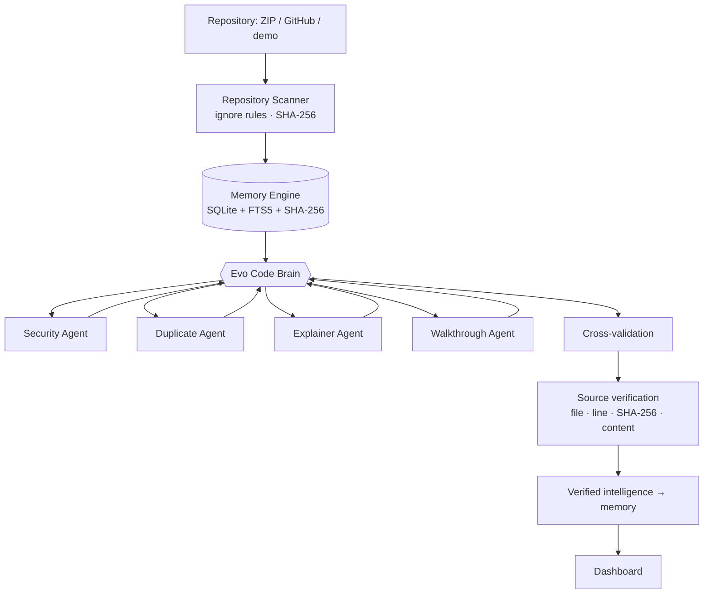

# Evo Code

**Your AI Code Brain.**

Persistent memory. Multi-agent intelligence. Verified source-level reasoning.

> Evo Code is a persistent AI harness that turns a codebase and previous engineering work into verified, reusable memory.

Upload a repository and Evo Code builds a temporary engineering brain around it: it scans and indexes the code into searchable memory, a central **Brain** routes work to specialist agents, cross-validates their claims, and verifies every important conclusion against the actual source with SHA-256. Every finding points at an exact file and line, and Evo Code notices when that source changes.

| Home | Brain orchestration |
| --- | --- |
|  |  |
| **Verified findings** | **Source viewer: stale detection** |
|  |  |
| **Memory Q&A with citations** | **Two-minute walkthrough** |
|  |  |

## What it does

- **Repository ingestion**: ZIP upload, public GitHub URL, or the bundled demo repo. Extraction is zip-slip and zip-bomb safe; repository code is never executed.
- **Persistent memory**: files, symbols, doc sections and later the Brain's own findings are stored in SQLite with FTS5 full-text search and SHA-256 hashes.
- **The Brain**: understands the task, loads context, retrieves memory, routes agents with explicit reasons, aggregates, cross-validates and verifies.
- **Specialist agents**
  - 🛡 **Security Agent**: 22 evidence-based rules (hardcoded secrets, SQL/command injection, eval, weak JWT handling, CORS, XSS, exposed env vars, prompt-injection text …), optionally reviewed by an LLM.
  - ♻ **Duplicate Code Agent**: structural clone detection that points at the implementation that *already exists* (for example `utils/validation.js`).
  - 🧭 **Explainer Agent**: stack, modules, request flows traced from UI to database, important files and engineering history, each with citations.
  - 🎬 **Walkthrough Agent**: a presentation-ready, two-minute tour built from the other agents' results.
- **Cross-validation**: unsupported claims are rejected, wrong line numbers are corrected, duplicate detections are merged, severity conflicts are resolved.
- **Source verification**: every finding and citation is anchored to the SHA-256 of the cited lines. Change the code and the finding turns **STALE**; re-run the analysis and memory records it as **resolved**.
- **Memory Q&A**: "Where is authentication implemented?" returns an answer with verified `file:line` citations.
- **Honest modes**: without an `OPENAI_API_KEY` everything runs locally and deterministically, and the UI labels it **DEMO / LOCAL ANALYSIS**.

## How it works



Agents never talk to each other. The Brain passes upstream results explicitly (for example Explainer → Walkthrough) and is the only component that writes findings and memory. See [ARCHITECTURE.md](ARCHITECTURE.md).

## Quick start

Requirements: **Python 3.11+** (tested on 3.14) and **Node.js 20.19+ or 22.12+** (tested on 24). No database server, Docker or API key needed.

```bash
git clone <repository-url> evo-code
cd evo-code

# 1. Backend (terminal 1)
cd backend
python3 -m venv .venv
source .venv/bin/activate
pip install -r requirements-dev.txt
uvicorn main:app --reload            # http://127.0.0.1:8000

# 2. Frontend (terminal 2)
cd frontend
npm install
npm run dev                          # http://localhost:5173
```

Open http://localhost:5173 and click **Try the demo repo**. Optional: `cp .env.example .env` and set `OPENAI_API_KEY` to enable LLM enrichment. Full details are in [DEVELOPMENT.md](DEVELOPMENT.md).

## Demo

The bundled [`demo-repo/`](demo-repo) ("ShopLite") is intentionally vulnerable and produces, with no LLM: 12 security findings (6 high), 4 duplicate clusters, 2 traced request flows, a 120-second walkthrough, and 16/16 verified findings. The judge script with timings is in [DEMO.md](DEMO.md).

## Environment variables

All optional. Defaults live in [`.env.example`](.env.example).

| Variable | Default | Purpose |
| --- | --- | --- |
| `OPENAI_API_KEY` | empty | Enables LLM enrichment. Empty = deterministic local analysis. |
| `OPENAI_MODEL` | `gpt-4o-mini` | Chat model used for JSON-mode calls. |
| `OPENAI_BASE_URL` | `https://api.openai.com/v1` | OpenAI-compatible endpoint. |
| `EVO_LLM_PROVIDER` | `auto` | `auto`, `openai` or `mock` (force local). |
| `EVO_DATA_DIR` | `.evo-data` | SQLite DB, uploads and isolated working copies. |
| `EVO_MAX_UPLOAD_MB` / `EVO_MAX_EXTRACTED_MB` | `50` / `200` | Upload and extraction limits. |
| `EVO_MAX_FILE_KB` / `EVO_MAX_FILES` | `512` / `3000` | Per-file and per-repo indexing limits. |
| `EVO_PACING_MS` | `350` | Minimum visible time per Brain stage (demo pacing, never changes results). `0` = instant. |
| `EVO_ALLOW_SOURCE_EDITS` | `true` | Enables "Simulate a code change" in the source viewer (working copy only). |
| `EVO_SIMULATE_AGENT_FAILURE` | empty | e.g. `walkthrough` to demonstrate graceful degradation. |
| `EVO_CORS_ORIGINS` | `http://localhost:5173,http://127.0.0.1:5173` | Allowed browser origins. |
| `GITHUB_TOKEN` | empty | Private repos and higher GitHub rate limits. |

## API

| Method | Path | Purpose |
| --- | --- | --- |
| `GET` | `/api/health` | Mode (LLM or local), FTS5, limits |
| `POST` | `/api/repository/analyze` | Start an analysis (multipart: `file`, `github_url` or `use_demo`, optional `task`) |
| `GET` | `/api/repository/{id}` | Live status: Brain state, agents, metrics, timeline |
| `POST` | `/api/repository/{id}/reanalyze` | Re-run on the current working copy |
| `GET` | `/api/findings/{id}` | Security + duplicate findings (re-verified live), architecture, cross-validation |
| `POST` | `/api/memory/search` | Ask a question, get a cited answer |
| `GET` | `/api/walkthrough/{id}` | Two-minute walkthrough with verified citations |
| `GET` | `/api/source/{id}?path=` | Source file + current vs indexed SHA-256 |
| `POST` | `/api/source/{id}/edit` | Simulate a one-line change in the working copy |
| `GET` | `/api/repositories` | Recent analyses |

Request/response examples: [API.md](API.md). Interactive docs: http://127.0.0.1:8000/docs.

## Project structure

```text
evo-code/
├── backend/
│   ├── main.py, app_factory.py, config.py, services.py, logging_config.py
│   ├── api/            # FastAPI routes, schemas, source viewer endpoints
│   ├── orchestrator/   # brain.py, router.py, crossval.py, evidence.py, qa.py, pipeline.py, progress.py
│   ├── agents/         # base.py (contract), security, duplicate, explainer (+architecture/flows/history), walkthrough
│   ├── memory/         # database.py (schema, recovery), store.py, indexer.py, search.py, tokens.py
│   ├── repo/           # scanner.py, parser.py, archive.py, github.py, paths.py, filters.py, text.py
│   ├── verification/   # citations.py (anchor + verify, SHA-256)
│   ├── llm/            # provider.py (OpenAI / local), prompts.py (guardrails, redaction)
│   └── tests/          # 61 pytest tests
├── frontend/src/       # pages, views, components, hooks, lib, api.ts, types.ts
├── demo-repo/          # intentionally vulnerable ShopLite store
├── docs/screenshots/
└── PRD · ARCHITECTURE · DESIGN · API · AGENTS · SECURITY · DEVELOPMENT · DEMO · DECISIONS · ROADMAP · CONTRIBUTING
```

## Testing

```bash
cd backend && source .venv/bin/activate && pytest     # scanner, memory, verification, agents, API
cd frontend && npm run build                           # strict TypeScript check + production build
```

## Security

Uploaded repositories are untrusted input: no code execution, no dependency installs, zip-slip/symlink/zip-bomb protection, sensitive files (such as `.env`) skipped without being read, secrets redacted before anything reaches an LLM, and repository text treated as data, never as instructions (the demo repo contains a planted prompt injection that Evo Code flags instead of obeying).

**The API has no authentication.** It binds to `127.0.0.1` and is meant for local use; do not expose it to a network as-is. See [SECURITY.md](SECURITY.md).

## Documentation

[PRD](PRD.md) · [Architecture](ARCHITECTURE.md) · [Design](DESIGN.md) · [API](API.md) · [Agents](AGENTS.md) · [Security](SECURITY.md) · [Development](DEVELOPMENT.md) · [Demo script](DEMO.md) · [Decisions](DECISIONS.md) · [Roadmap](ROADMAP.md) · [Contributing](CONTRIBUTING.md)
